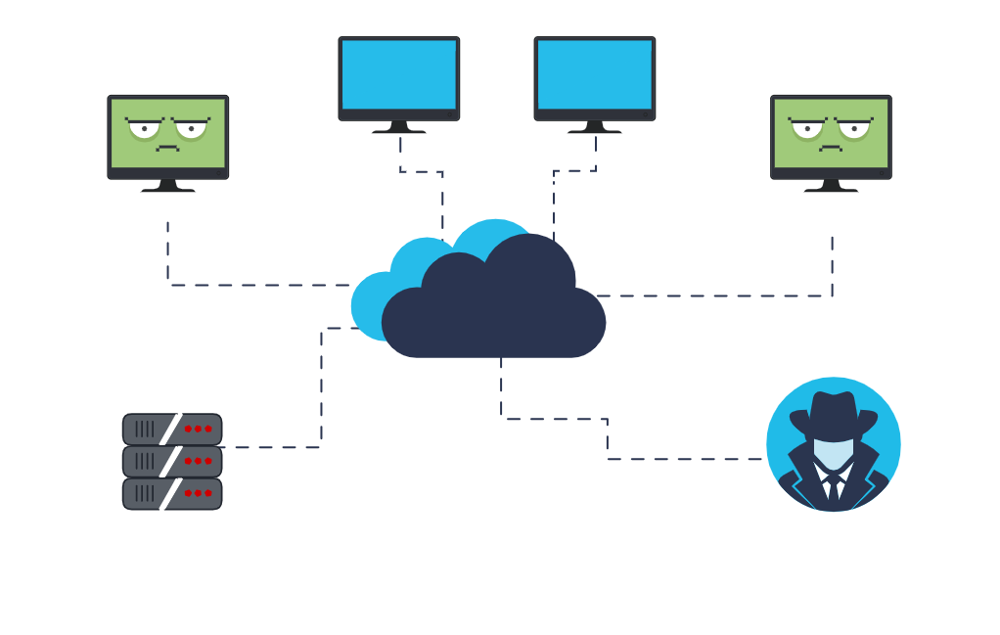

# Fundamentos

#### Penetration Test

O que seria?

Para exemplificar:

Você usaria um produto que nunca foi testado na prática?

* Teste de Invasão

\-> Consiste em usar técnicas de hackers para identificar vulnerabilidades em sistemas e redes.

&#x20;" Invadir para proteger "

* <mark style="background-color:blue;">Níveis</mark>

<figure><figcaption></figcaption></figure>


